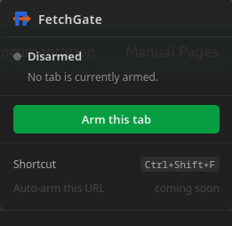
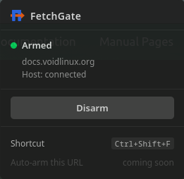

# FetchGate

<p align="center">
  
  &nbsp;&nbsp;&nbsp;&nbsp;
  
</p>

A Firefox WebExtension that bridges an external process to a live,
logged-in browser tab — execute authenticated HTTP requests or run arbitrary
JavaScript inside the tab, inheriting its full session state.

## What it does

When you are logged into a website, the browser holds session state — cookies,
tokens, TLS client certificates — that is not directly accessible to an external
program. FetchGate bridges that gap by turning an armed browser tab into a
programmable endpoint for your code.

Two modes are supported:

**Fetch mode** — your code sends a request spec; the extension executes the
corresponding `fetch()` inside the active tab and returns the full HTTP response:
status code, headers, and body. Because the request runs inside the tab's
JavaScript context, it inherits all session state automatically. No credentials
need to be extracted or replayed.

**JS mode** — your code sends a JavaScript snippet; the extension executes it as
an `async` function body inside the tab and returns the result. This lets you do
anything the tab's JavaScript context can do: traverse the DOM, call internal
APIs that are not reachable from outside the browser, aggregate data across
multiple requests, or run logic that depends on live page state.

**Target use case:** extracting your own data from websites that have accounts
but no public API, or that actively block third-party HTTP clients.

**Platform:** GNU/Linux only.

## Choosing a host

FetchGate requires a *native host* — a process that Firefox launches to bridge
the extension and your code. Three implementations are provided:

| | Java host | Python TCP host | Python embedded host |
|---|---|---|---|
| Location | `src/` | `host_py/fetchgate_tcp_host.py` | `host_py/example.py` |
| Requires | JDK 21+, **or Docker** | Python 3.6+ | Python 3.6+ |
| How it works | Persistent TCP server on `localhost:9919`; any caller connects over TCP | Same TCP interface as the Java host; Firefox launches it directly — no JDK or Docker needed | Firefox launches your script directly; the script IS the host |
| Good for | Callers in any language, interactive use, multiple scripts | Callers in any language when Java is not available | A single Python script with a specific job |
| Start it | Firefox starts it automatically on first arm | Firefox starts it automatically on first arm | Firefox starts it automatically when you arm a tab |

Both hosts speak the same protocol to the extension. The extension code is
identical regardless of which host you use.

## Architecture

### Java host

```
Your code (any language)
    │
    │  newline-delimited JSON  ·  TCP localhost:9919
    │
    ▼
Java native host  (src/)
    │
    │  Firefox Native Messaging  ·  4-byte LE length-prefixed JSON on stdin/stdout
    │
    ▼
background.js
    │
    │  browser.tabs.sendMessage()
    │
    ▼
content_script.js
    └─ runs fetch() or arbitrary JS in the tab, returns result up the chain
```

Firefox launches the Java host automatically when you arm the first tab. It
runs as a persistent server on `localhost:9919` until Firefox or the Java
process exits. You connect to it from any language over plain TCP. A single
TCP connection supports multiple sequential requests — connect, send as many
requests as you need, then disconnect.

### Python TCP host

```
Your code (any language)
    │
    │  newline-delimited JSON  ·  TCP localhost:9919
    │
    ▼
fetchgate_tcp_host.py  (host_py/)  — Firefox launches this directly
    │
    │  Firefox Native Messaging  ·  4-byte LE length-prefixed JSON on stdin/stdout
    │
    ▼
background.js
    │
    │  browser.tabs.sendMessage()
    │
    ▼
content_script.js
    └─ runs fetch() or arbitrary JS in the tab, returns result up the chain
```

Drop-in Python replacement for the Java host. Firefox launches
`fetchgate_tcp_host.py` when you arm the first tab; it binds `localhost:9919`
and proxies between TCP clients and the browser. Any caller that works with
the Java host works unchanged. Multiple concurrent TCP connections are accepted
and handled in threads; NM access is serialised internally.

### Python embedded host

```
Your Python script  (host_py/)
    │
    │  Firefox Native Messaging  ·  stdin/stdout  (your script IS the host)
    │
    ▼
background.js
    │
    │  browser.tabs.sendMessage()
    │
    ▼
content_script.js
    └─ runs fetch() or arbitrary JS in the tab, returns result up the chain
```

Firefox launches your Python script when you arm a tab. The script calls
`fg.fetch()` as many times as it needs, then exits. Arming the tab is
the trigger that runs the script — there is no separate server to start.

## How it works internally

**Native Messaging protocol:** Firefox communicates with the native host using
its [Native Messaging][nm] protocol — each message is a 4-byte little-endian
unsigned integer (payload length in bytes) followed by a UTF-8 JSON payload,
sent over the process's stdin/stdout. Firefox enforces a hard 1 MB per-message
limit.

**Request envelope:** every request the host sends to Firefox is wrapped in a
controlled outer object:

```json
{"__fg_id": 1, "req": "{\"method\":\"GET\",\"url\":\"/\"}"}
```

`__fg_id` is a per-request integer used for reply correlation. `req` is the
caller's JSON serialised as a string — `background.js` calls
`JSON.parse(msg.req)` to validate and unpack it. This keeps JSON structure
validation inside the JavaScript engine and ensures `__fg_id` appears only in
the outer layer, eliminating false-positive response matching. `background.js`
echoes `__fg_id` in every reply; the host matches by ID and discards stale
replies left over from timed-out requests. Both fetch mode and JS mode use this
same envelope — only the contents of `req` differ (`{"url":...}` vs `{"js":...}`).

**Extension permissions:**
- `nativeMessaging` — required to call `browser.runtime.connectNative()`.
- `activeTab` — grants script-injection rights on the tab the user just
  clicked. Sufficient for the initial arm, but expires after the click gesture.
- `<all_urls>` — required for re-injection when the armed tab navigates. The
  `tabs.onUpdated` listener calls `browser.tabs.executeScript` outside a user
  gesture, so `activeTab` no longer applies; a host permission is needed.
  Without it, navigation would silently leave the tab without a content script
  while the badge still shows ON.
- `tabs` — grants access to tab lifecycle events (`onUpdated`, `onRemoved`)
  and ensures `changeInfo.status` is populated in `onUpdated` callbacks, which
  FetchGate uses to detect when a navigation has completed and re-inject the
  content script.
- `notifications` — sends desktop notifications when a tab is armed or
  disarmed, and when the native host process disconnects unexpectedly.

**Design constraint:** the extension is intentionally minimal. Its only job is
to execute what the native host asks — a `fetch()` call or a JavaScript snippet
— and return the result. Semantic validation, error handling, and business logic
belong in the native host or the caller.

## Message format

There are two request modes: **fetch** and **js**. The presence of `"js"` selects
JS mode; otherwise fetch mode is used.

### Fetch mode

Run a `fetch()` call inside the tab and return the full HTTP response.

```json
{ "method": "GET", "url": "/api/v2/user/profile", "headers": {"Accept": "application/json"} }
```

| Field | Required | Description |
|---|---|---|
| `url` | yes | Absolute URL or path relative to the current tab's origin |
| `method` | no | HTTP method — defaults to `GET` |
| `headers` | no | Object of additional request headers |
| `body` | no | Request body string (for POST, PUT, etc.) |
| `credentials` | no | `"same-origin"` (default), `"include"`, or `"omit"` |

Response:

```json
{ "status": 200, "statusText": "OK", "headers": {"content-type": "application/json"}, "body": "..." }
```

`body` is always a string — parse it according to `content-type`.

### JS mode

Execute arbitrary JavaScript in the tab context and return the result.

```json
{ "js": "const r = await fetch('/api/orders'); const d = await r.json(); return d;" }
```

| Field | Required | Description |
|---|---|---|
| `js` | yes | JavaScript code to execute (function body — may use `await` and `return`) |

The code runs as the body of an `async` function. Use `return` to pass a value
back to the caller. Strings are returned as-is; all other values are
`JSON.stringify`'d. No `return` (or `return` with no value) yields an empty string.

Response:

```json
{ "result": "..." }
```

**Isolated world:** the code runs in the content script's sandbox. It has full
access to the DOM and `fetch()` (inheriting the tab's cookies and session state),
but cannot read JavaScript variables set by the page's own scripts
(e.g. `window.angular`, `window.__PRELOADED_STATE__`).

Errors are returned as `{ "error": "..." }` in both modes rather than thrown.

## Requirements

- GNU/Linux
- Firefox, Firefox Developer Edition, Firefox Nightly, or LibreWolf
- **Java host:** JDK 21+, **or Docker** (no JDK needed — the image compiles and runs the host)
- **Python TCP host:** Python 3.6+
- **Python embedded host:** Python 3.6+

## Installation

Full step-by-step instructions for all hosts are in **[INSTALL.md](INSTALL.md)**.

### Step 1 — Install the extension

Download **[fetchgate-0.2.0.xpi](https://github.com/simddev/FetchGate/releases/latest)** from the Releases page, then install it in Firefox or LibreWolf using either method:

- **Drag and drop:** drag the `.xpi` file into any browser window and click **Add** when prompted.
- **From the Add-ons Manager:** open `about:addons`, click the gear icon ⚙ → **Install Add-on From File**, and select the `.xpi`.

Then pin the FetchGate icon to the toolbar via the extensions (puzzle-piece) menu. The extension persists across browser restarts — no re-loading needed.

> The extension is also available on [Firefox Add-ons (AMO)](https://addons.mozilla.org/en-US/firefox/addon/fetchgate/) — search for **FetchGate** or install directly from the listing. Installing from AMO gives automatic updates.

> **Developers:** you can also load the extension without installing it by going to `about:debugging → This Firefox → Load Temporary Add-on` and selecting `extension/manifest.json`. Temporary add-ons do not survive browser restarts.

### Step 2 — Install a host

Choose one host and follow its quick summary below. Full instructions are in [INSTALL.md](INSTALL.md).

**Java host — quick summary (JDK):**
1. `javac -d out src/*.java`
2. Create `~/bin/fetchgate.sh` pointing at the compiled classes; `chmod +x` it
3. Copy `fetchgate.json` to `~/.mozilla/native-messaging-hosts/fetchgate.json`
   and set `"path"` to your launcher script

**Java host — quick summary (Docker, no JDK required):**
1. `docker build -t fetchgate .`
2. Create `~/bin/fetchgate.sh` containing `exec docker run --rm -i --network=host fetchgate`; `chmod +x` it
3. Copy `fetchgate.json` to `~/.mozilla/native-messaging-hosts/fetchgate.json`
   and set `"path"` to your launcher script

**Python TCP host — quick summary (Java-free, same TCP interface):**
1. `chmod +x host_py/fetchgate_tcp_host.py`
2. Copy `fetchgate_tcp_py.json` to `~/.mozilla/native-messaging-hosts/fetchgate.json`
   and set `"path"` to the absolute path of `host_py/fetchgate_tcp_host.py`
3. Arm a tab — Firefox launches the host automatically

**Python embedded host — quick summary:**
1. Copy `host_py/example.py` to a permanent location; `chmod +x` it
2. Edit it with your fetch calls (keep the `from fetchgate import FetchGate` line)
3. Copy `fetchgate_py.json` to `~/.mozilla/native-messaging-hosts/fetchgate.json`
   and set `"path"` to your script

## Interface

FetchGate is controlled through a toolbar popup and a configurable keyboard shortcut.

### Toolbar popup

Click the FetchGate icon to open the popup. It shows the current state and
offers a single context-appropriate action:

| State | Badge | What you see | Action |
|---|---|---|---|
| Disarmed | *(none)* | No tab is armed | **Arm this tab** |
| Armed — this tab | **ON** (green) | Domain · Host: connected | **Disarm** |
| Host disconnected | **ERR** (red) | Domain · Click Reconnect… | **Reconnect** |
| Armed — other tab | **ON** or **ERR** | Other domain | **Arm this tab instead** |

The popup refreshes every 750 ms while it is open, so it always reflects the
latest state even if the tab was armed or disarmed via keyboard shortcut while
the popup was visible.

### Keyboard shortcut

The default shortcut is **Ctrl+Shift+F**. It toggles arm/disarm on the active tab
without opening the popup.

To change the shortcut: open the FetchGate popup → click the shortcut display
at the bottom → press the new key combination. After saving, FetchGate asks you
to press the shortcut once to verify it works — some combinations are silently
captured by Firefox or the desktop environment before the extension sees them,
and this step catches those conflicts.

## Usage

### Java host / Python TCP host

Both hosts expose the same `localhost:9919` TCP interface. Usage is identical:

1. Navigate to the site you want to query (log in if needed)
2. Click the **FetchGate** toolbar button and then **Arm this tab**, or press
   **Ctrl+Shift+F** — Firefox starts the host and the badge turns green **ON**
3. From any terminal or program, send a JSON line to `localhost:9919`:

```bash
echo '{"method":"GET","url":"/robots.txt"}' | timeout 3 nc localhost 9919
```

`timeout 3` is needed when testing against the **Java host** — it keeps the
connection open for persistent callers, so without it `nc` hangs after
receiving the response. The **Python TCP host** closes the connection after
each response, so `nc` exits cleanly without `timeout 3` (though using it is
harmless). `/robots.txt` is a safe test endpoint — it is always small. Avoid
`"url":"/"`: many homepages exceed the 1 MB Native Messaging size limit and
will return an error even on a healthy setup.

### Python embedded host

1. Navigate to the target site (log in if needed)
2. Click the **FetchGate** toolbar button and then **Arm this tab**, or press
   **Ctrl+Shift+F** — Firefox immediately launches your Python script; the
   badge turns green **ON** while it runs
3. Your script calls `fg.fetch()` and does whatever it needs with the results
4. When the script exits, the badge shows **ERR** — this is normal

```python
#!/usr/bin/env python3
import sys
sys.path.insert(0, "/absolute/path/to/FetchGate/host_py")  # replace with real path
from fetchgate import FetchGate

fg = FetchGate()
# Note: after FetchGate(), sys.stdout is redirected to stderr to protect
# the Native Messaging stream. Use sys.__stdout__ to write to real stdout.

resp = fg.fetch({"method": "GET", "url": "/api/data"})
if "error" not in resp:
    sys.__stdout__.write(resp["body"])
    sys.__stdout__.flush()

# JS mode — run arbitrary JavaScript in the tab
resp = fg.fetch({"js": "const r = await fetch('/api/orders'); return r.json();"})
if "error" not in resp:
    sys.__stdout__.write(resp["result"])
    sys.__stdout__.flush()
```

Open the popup and click **Arm this tab** again, or press **Ctrl+Shift+F**, to re-run the script.

## Building and testing

**Java host:**

```bash
# Compile Java source
javac -d out src/*.java

# Run the test suite (64 tests, no external dependencies)
javac -d out src/*.java tests/*.java
java  -cp out TestRunner
```

**Python hosts:**

```bash
# NM library (31 tests, no external dependencies)
python3 host_py/test_fetchgate.py

# Python TCP host (16 tests, no external dependencies)
python3 host_py/test_fetchgate_tcp_host.py
```

The Python hosts require no compilation. Python 3.6+ is the only requirement.

## Security model

**Java host / Python TCP host:** the TCP server binds exclusively to `localhost`
and is not reachable from other machines. However, **any local process that can
reach `localhost:9919`** — including other applications, scripts, and on a
multi-user system, other users — can send requests to the armed tab. There is
no authentication.

Important: the TCP server starts when the first tab is armed and **stays open
until Firefox or the host process exits**. Disarming a tab does not close the
port. If you arm a tab to run a single request and then disarm it, the port
remains accessible until you close Firefox.

**Python embedded host:** there is no TCP port. Only the Python script
registered in the native messaging manifest can interact with the extension,
and only while Firefox has it running (i.e. while a tab is armed). This makes
the embedded Python host inherently more contained.

Both models are acceptable trade-offs for a personal tool on a single-user
machine. Do not run the Java host on shared or multi-user infrastructure.

## Known limitations

- **Single caller at a time. *(Java host only)*** The host handles one TCP
  connection at a time. While a request is in flight — or while the current
  caller has the socket open without sending — no second caller can be served.
  For personal use this is fine; use short-lived connections (connect, request,
  read response, disconnect) if multiple callers need to share the service.

- **One request per connection. *(Python TCP host only)*** The Python TCP host
  closes the TCP connection after sending each response. Callers must open a
  new connection for every request. The Java host keeps connections open and
  supports multiple sequential requests per socket.

- **Single-line JSON only.** The TCP protocol is newline-delimited: each
  request must be compact JSON on a single line. Multi-line or pretty-printed
  JSON is not supported by either host. The Java host additionally requires the
  request to start with `{` and end with `}` (a JSON object, not an array or
  scalar) and rejects non-object requests with an error response.

- **30-second request timeout. *(Java host only)*** If the extension does not
  reply within 30 seconds, the host sends `{"error":"timeout: ..."}` and closes
  the connection. The in-tab `fetch()` continues running in the browser; the
  eventual late reply is discarded by ID matching.

- **No request timeout. *(Python hosts only)*** `fetch()` blocks until the
  extension replies or the Native Messaging connection closes. If the server
  being queried is slow or unresponsive, the host will block indefinitely.
  TCP callers (e.g. hunter.py) can impose their own socket timeout on the
  client side independently of this.

- **One armed tab at a time.** The extension tracks a single armed tab. Arming
  a second tab automatically disarms the first. After a disconnect (ERR badge),
  open the popup and click **Reconnect** to restore the connection.

- **Extension reloads on browser restart — if loaded as a temporary add-on.**
  Temporary add-ons (loaded via `about:debugging`) do not survive browser
  restarts. Install the signed `.xpi` from the
  [Releases page](https://github.com/simddev/FetchGate/releases/latest) instead
  — it persists across restarts and works in Firefox and LibreWolf without any
  configuration changes.

- **Response capped at ~1 MB serialized.** Firefox's Native Messaging protocol
  limits individual messages to 1 MB. The content script measures the full
  serialized reply (status + headers + body, in UTF-8 JSON bytes) and returns
  `{"error":"response too large ..."}` if it exceeds 1 000 000 bytes, keeping
  a small margin for the envelope added by `background.js`. API responses are
  typically well under this limit; full HTML pages of content-heavy sites
  (e.g. YouTube) often exceed it.

- **Cross-origin requests require explicit credentials opt-in.** The default
  `fetch()` credentials mode is `"same-origin"`, meaning cookies and auth
  headers are only sent automatically for URLs on the same origin as the armed
  tab. For cross-origin URLs, set `"credentials":"include"` — but the target
  server must also respond with `Access-Control-Allow-Credentials: true` and a
  specific (non-wildcard) origin, or the browser will block the response.

- **Multiple `Set-Cookie` response headers are deduplicated.** The content
  script stores headers in a plain JavaScript object. The Fetch API combines
  most duplicate header values with `, `, but delivers each `Set-Cookie` value
  as a separate call. Because plain object assignment overwrites on each call,
  only the last `Set-Cookie` value survives. This rarely matters for
  data-extraction requests.

- **Response body is always decoded as UTF-8 text.** The content script reads
  the body with `response.text()`, which — per the WHATWG Fetch spec — always
  decodes using UTF-8, ignoring any charset declared in `Content-Type`. Binary
  payloads (images, PDFs, ZIPs, protobuf) will be corrupted. Pages encoded in
  non-UTF-8 charsets (Shift-JIS, Windows-1252, etc.) will also be corrupted,
  even if `Content-Type` correctly declares the encoding. The practical impact
  is low: the overwhelming majority of modern sites serve UTF-8.

- **Infinite loops in JS mode block the tab entirely.** JavaScript executed via JS mode runs on the browser's main thread inside the tab. If the code contains an infinite loop, the tab's main thread is blocked — subsequent requests to that tab, including fetch-mode requests, also hang until the user navigates away or closes the tab. The Java host returns a timeout error after 30 seconds, but the loop keeps running; the Python host blocks indefinitely. There is no way for the extension to interrupt running JavaScript.

- **Logs may contain sensitive data. *(Java host only)*** The Java host logs
  every request and response to stderr, truncated at 120 characters. On a
  multi-user system this output may be visible in terminal history or system
  journals. Run the host in a dedicated terminal; do not pipe stderr to
  persistent storage. The Python hosts perform no logging of request or
  response content.

## Project structure

```
src/                    Java native host (TCP bridge)
  Main.java             Entry point — redirects stdout to stderr to protect NM channel
  NativeMessaging.java  Firefox Native Messaging framing (length-prefixed JSON)
  NativeHost.java       TCP server, stdin-reader thread, full request lifecycle

host_py/                Python native hosts
  fetchgate.py          Native Messaging library; import this in your script
  example.py            Working example script to copy and customise (embedded host)
  fetchgate_tcp_host.py Python TCP host — drop-in replacement for the Java host
  test_fetchgate.py     Python test suite — NM library (31 tests, no external framework)
  test_fetchgate_tcp_host.py  Python test suite — TCP host (16 tests, no external framework)

extension/              WebExtension — shared by both hosts, never changes
  manifest.json         MV2 manifest; extension ID: fetchgate@localhost
  background.js         Armed-tab state, connectNative(), message routing
  content_script.js     Executes fetch() or arbitrary JS in the tab, returns the result
  popup.html            Toolbar popup markup
  popup.js              Popup logic — state display, button actions, shortcut recorder

tests/                  Java test suite (no external framework)
  TestRunner.java       Runner and output harness
  Assert.java           Assertion helpers
  NativeMessagingTest.java  NM framing protocol tests
  NativeHostTest.java       TCP↔NM bridge and request lifecycle tests

ARCHITECTURE.md         Project architecture, IPC protocol, build commands, design constraints
Dockerfile              Multi-stage build for the Java host (no JDK required)
fetchgate.json          Native Messaging manifest template — Java host
fetchgate_py.json       Native Messaging manifest template — Python embedded host
fetchgate_tcp_py.json   Native Messaging manifest template — Python TCP host
fetchgate-0.2.0.xpi     Signed extension — install directly in Firefox or LibreWolf
INSTALL.md              Step-by-step installation guide
```

## License
  
GNU General Public License v3 — see [LICENSE](LICENSE).  
  
[nm]: https://developer.mozilla.org/en-US/docs/Mozilla/Add-ons/WebExtensions/Native_messaging  

## Contact
Any inquiries, please write to:  
simon.d.dev@proton.me  
